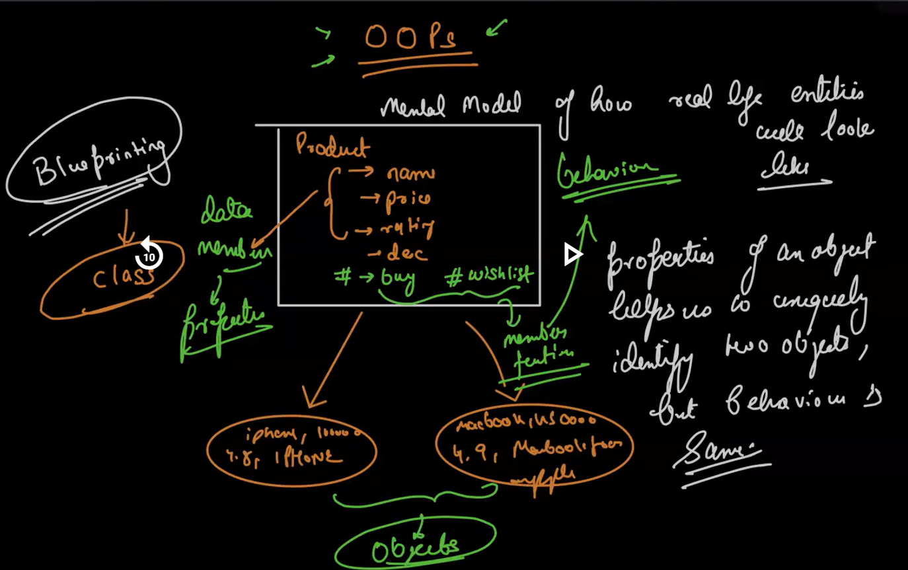

## **Object Oriented Programming In JS**
---
-  In order to prepare big applications where we have a lot of data coming here and their, and you want to represent the logic in terms of frontend backend and whereever you are storing it we need to have some blueprinting mechanism. So that we can prepare a logical mental model.

- Once we have the blueprinting then we can start populating values to it and construct real life enities. This blueprinting paradigm is known as *`Object oriented programming`*.

- OOPs can be a bit different from programming language to programming language. Because there are sometimes language based restrictions

- In Javascript the OOPs is completely different maybe the keywords have similarities with other languages but the concept and the usage are different from them

- Preparing the blue print of the mental model of whatever real life entity we have is known as *`class`*

- Once the blueprint is ready we can created multiple real life entity. ex: products. These real life entities are called *`objects`*.

- *`Properties`* of an object helps us to uniquely identify two objects but behaviour is same(ex: Display a product, buy a product etc). In technical term the properties are termed as *`data members`* and the behaviour are called *`member function`*

- Class Demonstration Screenshot:
<p align="center">
  
</p>

- In JS we have a *`class`* keyword. Using which we can prepare blueprint.
```Javascript

class <name>{
    // Properties
    // Behaviour
}
```
Using this we can create entities/objects

- Now in order to create and manage the entities we have two new keywords *`new`* and *`this`*

Now these 3 kewords together i.e  *`class`*, *`new`* and *`this`* forms the basis of how we write OOPs in JS

-Syntax to create a  [Class](./Demo/class_Demo.js)
```Javascript
class Product {
    // no need of let var const
    name;
    price;
    discount;
    desc;

    display() {
        // no need to function keyword
    }
    buy(){
        // no need to function keyword
    }
}
```

- Syntax to create an [object](./Demo/class_Demo.js)
```Javascript
const p = new Product();
```
To understand the syntax of object, we need to first understand `this`

- [*`this`* ](./Demo/this_demo.js)keyword: except one case `this` always refers to the calling site/context. From what context and what reference we are calling it makes the difference . **this** will not always point to the same object from which we are making the function call 

- The one case where *`this`* doesn't refer to the calling context is when *`arrow function`* is getting used. Inside arrow function this doesn't refer to the calling context. By default in arrow function this is going to be resolved lexically. [Code Demo](./Demo/this_demo2.js)