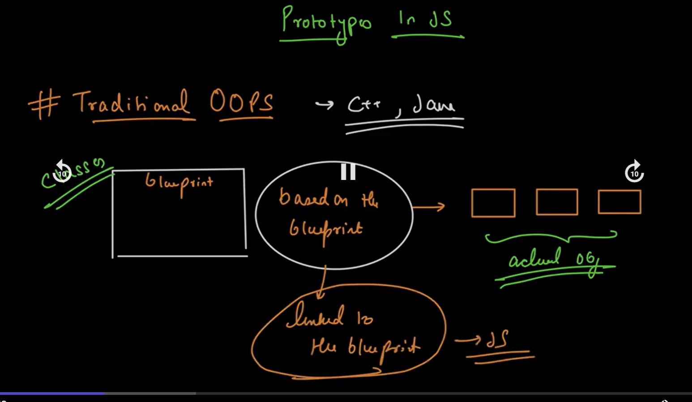
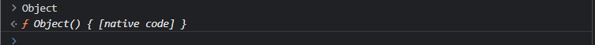
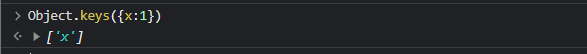
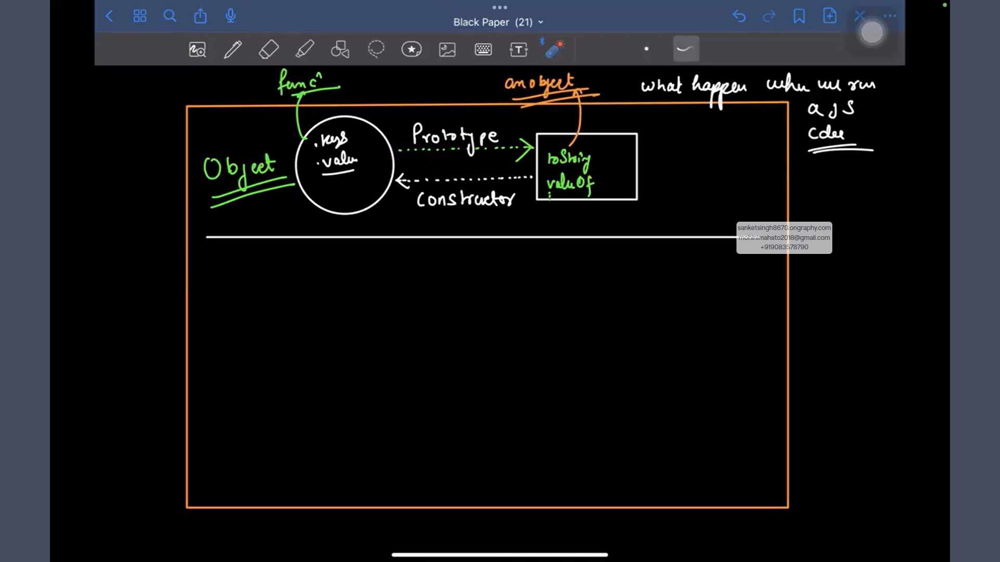
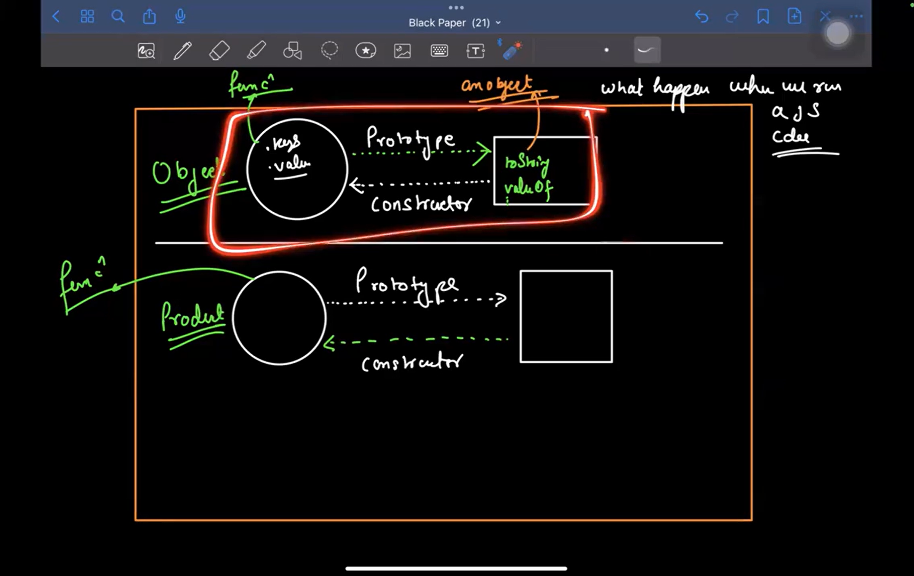
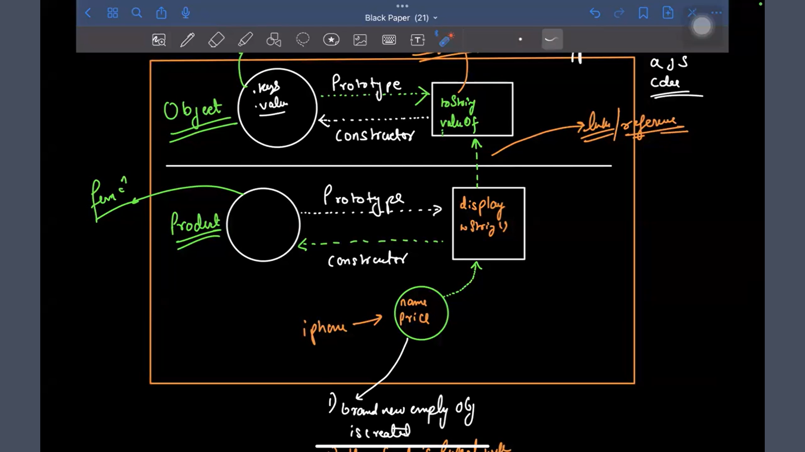

## **Object Oriented Programming In JS**
---
-  In order to prepare big applications where we have a lot of data coming here and their, and you want to represent the logic in terms of frontend backend and whereever you are storing it we need to have some blueprinting mechanism. So that we can prepare a logical mental model.

- Once we have the blueprinting then we can start populating values to it and construct real life enities. This blueprinting paradigm is known as *`Object oriented programming`*.

- OOPs can be a bit different from programming language to programming language. Because there are sometimes language based restrictions

- In Javascript the OOPs is completely different maybe the keywords have similarities with other languages but the concept and the usage are different from them

- Preparing the blue print of the mental model of whatever real life entity we have is known as *`class`*

- Once the blueprint is ready we can created multiple real life entity. ex: products. These real life entities are called *`objects`*.

- *`Properties`* of an object helps us to uniquely identify two objects but behaviour is same(ex: Display a product, buy a product etc). In technical term the properties are termed as *`data members`* and the behaviour are called *`member function`*

- Class Demonstration Screenshot:
<p align="center">
  
</p>

- In JS we have a *`class`* keyword. Using which we can prepare blueprint.
```Javascript

class <name>{
    // Properties
    // Behaviour
}
```
Using this we can create entities/objects

- Now in order to create and manage the entities we have two new keywords *`new`* and *`this`*

Now these 3 kewords together i.e  *`class`*, *`new`* and *`this`* forms the basis of how we write OOPs in JS

-Syntax to create a  [Class](./Demo/class_Demo.js)
```Javascript
class Product {
    // no need of let var const
    name;
    price;
    discount;
    desc;

    display() {
        // no need to function keyword
    }
    buy(){
        // no need to function keyword
    }
}
```

- Syntax to create an [object](./Demo/class_Demo.js)
```Javascript
const p = new Product();
```
To understand the syntax of object, we need to first understand `this`

---

- [*`this`* ](./Demo/this_demo.js)keyword: except one case `this` always refers to the calling site/context. From what context and what reference we are calling it makes the difference . **this** will not always point to the same object from which we are making the function call 

- The one case where *`this`* doesn't refer to the calling context is when *`arrow function`* is getting used. Inside arrow function this doesn't refer to the calling context. By default in arrow function this is going to be resolved lexically. [Code Demo](./Demo/this_demo2.js)

---

- [*`new`*]() keyword: The sole purpose of *new* keyword is to create a brand new plain javascript empty object nothing more nothing less


---

```Javascript
class Product {
    // no need of let var const
    name;
    price;
    discount;
    desc;

    display() {
        // no need to function keyword
    }
    buy(){
        // no need to function keyword
    }
}
const p = new Product()

```
- When we write the name of the class (and in this case Product) and pairing it up with a pair of parenthesis, this particular syntax is calling a *`constructor`* of the class.

- Now *`what's the constructor`*? -> Whenever we create a object of a class, *`constructor`* is the first function that's actually getting called. 

1. What's the purpose of this constructor?
-> Let's say we are creating a object we want to initialize the object with some corresponding values or let's say setup some connection whatever we want to do which should happen when we are creating a new object all of that logic we put inside the constructor. 

-> It's a *special* method
-> In the above example we have not written any constructor so javascript with use the default constructor. So, whenever we write the **class name** with a pair of **()** it calls the default constructor all together
So, now if we do 
```Javascript
console.log(p);

// Product { name: undefined, price: undefined, desc: undefined }
// there's no error at all it calls the default constructor and since there's no property assigned all of them returns undefined
```

2. Let's say we want to initialize our own constructor. The *new* keyword is creating a brand new plain empty object and then actually we are calling the constructor

3. We can create a constructor using the keyword *constructor(){}*

```Javascript
constructor(){

}
```

4. Now, as we know the *new keyword* creates a brand new empty object and we are calling the *constructor* product(). This constructor is getting called w.r.t to the brand new plain empty object, so this brand new plain empty object is the calling context. Now if we use *this* inside *contructor(){this}*. Then *this* keyword will point to brand new plain empty object. 
Now we can do something like
```Javascript
constructor(n,p,d){
this.name = n;
this.price = p;
this.desc = d;
}
```
So, the contructor is pointing to the plain empty object and we are manually creating a key value pair where the key is name and the value is whatever we pass inside the name.
For example:

```Javascript
const p = new Product("Bag", 100 ,"a cool bag");
// Product { name: 'Bag', price: 100, desc: 'a cool bag' }
```

5. A question might pop that a constructor is a method that means its like a function and in a function we return something but here we are not returning anything. ->> Inside the constructor if we return anything primitive then there's no effect it'll technically just avoid it, because constructor is meant to do something with an object, it's meant to return an object. If we return a primitive the sole purpose of constructor is gone. 

***Important*** We can't do *constructor overloading in JS*

- Function Constructor: Whatever we are doing with class we can achieve it with functions as well and the behaviour is also same, class is just a wrapper over
```Javascript
function Product(n, d, p) {
    this.name = n;
    this.price = p;
    this.desc = d;
}
const p = new Product("Bag", 100, "a cool bag");
console.log(p)
// Product { name: 'Bag', price: 'a cool bag', desc: 100 }
```

----
- What is an *access modifier* ?
-> Access modifier maintaince what is visible outside and what is not visible outside in a class
To make it private Javascript has a shorthand: *`#NameOfTheVariableThatNeedsToBePrivate`*

- Let's say we want to expose a functionality to user from where they can get some properties and set some properties, do we need to make them public? 
-> NO, we can make getter setter's

```Javascript
class Product {

    #name; //private
    constructor(n, p, d) {
        this.name = n;
        this.price = p;
        this.desc = d;
    }

    // setter
    setName(n) {
        if (typeOf(n) = ! 'string') {
            console.log("Invalid name passes");
            return;
        }
        this.#name = n;
    }
    // getter
    getName(n){
        return this.#name;
    }

}
const p = new Product("Bag", 100, "a cool bag");
p.setName(-1);
// Invalid name passed
console.log(p)
// Product { name: 'Bag', price: 'a cool bag', desc: 100 }
```
----
Well in Js we get better syntax to write getter and setters, So it doesn't look like function and still looks like we are setting a value only but while setting also a whole set of logic that gets executed. We can use the `get` and `set` keyword. So now we access them as properties not function. 
```Javascript
class Product {

    #name; //private
    constructor(n, p, d) {
        this.name = n;
        this.price = p;
        this.desc = d;
    }

    // setter
    set setName(n) {
        if (typeOf(n) = ! 'string') {
            console.log("Invalid name passes");
            return;
        }
        this.#name = n;
    }
    // getter
    get getName(n){
        return this.#name;
    }

}
const p = new Product("Bag", 100, "a cool bag");
p.setName = "test";
// Invalid name passed
console.log(p)
// Product { name: 'Bag', price: 'a cool bag', desc: 100 }
```

So, this how we extract out internal details of class from the outside out that is not necessary for other to know

----

## *Prototype Based Inheritance*
- Traditional OOPs: In traditional languages such as C++, Java we have a abstract blueprint and *based* on these blueprint we actually create real life entities.

<p align="center">
  
</p>

- In JS the objects are not *based* on the blueprints they are technically *linked* to the blueprint.
What is this *linking* then? And what happens when we run a JS code?
-> When we try to run a JS code a lot of thing ofcourse happens a lexical scope gets created and all that. But there is one more thing that happens before the first line of code actually gets executed and this particular is extremely important w.r.t *How classes and objects works in JS*. Now we will take a deep dive and try to understand what is this and what it does with overall architecture of Javascript.

- A lot of time we might have seen capital "O"bject. 
<p align="center">
  
</p>
and the fun part is that it's a function. It looks like an object but technically it's a function and if we actually start using this Object, something like Object.keys() this function also provides us a bunch of properties that we can actually use let's say we pass an object and it returns the keys of the corresponding object .
<p align="center">
  
</p>
So, this "O"bject is technically a function which not only just provides us an object based functionality but us some extra properties like .keys() .value() that are extra utility function with us.

## *First Setup Before The Code Execution:*
<p align="center">
  
</p>


- Js maintains a function that we already know as "O"bject
 this function provide us a lot of feature for example `Object.keys` `Object.values` all of these are directly provided to us by this coresponding function, apart from this there is one more `object` and this is one of the most important `object` in the whole architecture of JS. Some very important utility function such as `toString`, `valueOf` all of these function that we never declared for our own object but we are able to invoke in an object are actually present in this object so what's the name of this object, in JS there's no specific name given to this object but we can refer to this object via a property on the 'O'bject that is known as *`prototype`*.

 - When we do  `object.prototype` then we are referening from the `Object` and there is a reverse chaining also that from `object` actually we have a property that refers back to `Object` function and that property is known as `constructor`. 

- Repeating what I just understood: Before the code starts executing there is a function named as capital "O"bject. We can actually call it as function it returns brand new plain object. And this functions has some properties such as `.keys` `.values` etc together with all these properties it has one more property as  `.prototype`. This `.prototype` actually points to another JS `object` because this JS `object` has all the functions/properties  like  `toString`, `valueOf` and all those functions/properties that are available on an object but we never wrote it ourselves. On this `object` we have one more property/function named as `constructor` same as toString and valueOf that actually points back to the original "O"bject
<p align="center">
  
</p>

----

- Few question might arise 
1. why we are doing the reverse chaining that from "Object" we are refering to prototype and from prototype we are refering to constructor. 
2. What is the use of prototype? Why we are using it and need it? Why this 'O'bject is pointing to the prototype? And what is a prototype chaining


## *Now let's move to our second setup:*
<p align="center">
  
</p>
-> We have been given the first setup and now we wrote some code

```Javascript
function Product(n,p){
    this.name = n,
    this.price = p
}
```
What is a Product here?
It's technically a function
```Javascript
Product ⏎
f Product(n,p){
    this.name = n;
    this.price = p;
}
```
Now, if we do `Product.` we start seeing a bunch of properties that we can actually call and one of the properties is named as *`prototype`*

- So, we created a new function product and on this product function we have property called *`.prototype`* and if we carefully see what *`.prototype`* is giving us, it giving us another object

```Javascript
Product.prototype ⏎
{constructor: f}
```
- That means the moment we create a function product along with that function there is an object that gets created. And we refer this object using *`.prototype`*. And if we carefully see from this object also there's an property *constructor* that goes from *`Product.prototype`* to point to Product. So if we do *`Product.prototype.constructor`* it's refering back to the function Product


```Javascript
Product.prototype.constructor ⏎
f Product(n,p){
    this.name = n;
    this.price = p;
}
```

- A similar setup that exist with "O"bject exist here.

### Summarising everything we understood till now

- Before our code executing there's a capital "O"bject function on this function there are bunch of properties. One of the properties is `Object.prototype` that points to another `object` on this `object` there are some of the most important properties  exist, this `object` has a property `constructor`  which points back to the "O"bject. *This was the pre-setup*

- Post setup when we start executing our code, let's say we wrote a function Product, in the function Product we have property prototype which is again pointng to an object and this object has a property constructor which is pointing back to product. 

- With any function that we are having we will have the same functionality actually going on behind the scenes . All of these will start making sense because all of these used to be the actual regular part of JS code before the intervention of class based wrappers . So we will understand `How constructor and everything works?`

- What's the meaning of the word prototype in plain english?
It refers to the word model or design, So using this we will actually prepare blueprints  a models and lot of stuff everything we are doing with classes we will be able to do with this

## *Third part of our setup:*
<p align="center">
  
</p>

- *Product.prototype* is actually internally linked/referenced with *Object.prototype*. 

- We have the function Product, now if we do: 

```Javascript
const iPhone = new Product("iPhone 14", 1000000) ⏎
```

So we know that when we call the new keyword a brand new plain empty object is created and then we are technically calling the product function. But behind the scenes something more happens.

- The moment we hit `new`
(Step 1) It creates a brand new empty object
(Step 2) Before anything else happens this object is actually linked with `Product.prototype`
(Step 3) We assign a `this` keyword which refers to the call site(the brand new empty object is the call site). And then we start executing the function Product which says this.name and this.price . So we assign a name property and a price property.

Atlast if we haven't manually returned another object from the function Product, JS will assume that we wanted to return ("iPhone 14", 1000000), and this object gets returned and stored in the variable iPhone.

So, the step 2 is the crux of whatever we were doing.

- Sanket talked about the product function to be constructor. Now just think on the brand new empty object we link this with Product.prototype and we try to call the constructor Product with respect to the iPhone object . Now the iphone doesn't have its own constructor but this object is linked to another object which has a property constructor that is refering to our product function and this is where things start becoming interesting and we will see *How all of this linkage is actually going to help us*

- If we do 

 ```Javascript
Product.prototype.display = function (){
    console.log("Details of the product are", this )
    } ⏎
```
What we have done is on our `Product.prototype` we have assigned a new function `display`.  If we do

 ```Javascript
iPhone.display()⏎
// Details of the product are 
// > product {name: 'Iphone 14', price: '1000000'}
```

So what is going on?
-> During runtime we come to our object, if we say *iPhone.xyz()* what will happen is, JS will check does your object iPhine has property *xyz* the answer is NO. So, what it will do is it will go one step above in the prototypal chain and see does Product.prototype has the display property, YES it has the display property/function and now it'll call it.

- So, we made changes to our prototype and those changes are actually reflecting in the object and that is why if we do something like `iPhone.toString()`  we get `[Object object]`

 ```Javascript
iPhone.toString()⏎
// [Object object]
```
Just think about it do we have toString property in iPhone obejct? NO, we go one level up
Do we have toString property in Product.prototype ? NO, we go one level up
Does Object.prototype has toString property? YES, and that's where the toString function comes up.

- This is the essence of how exactly *`prototypal chaining`* works. Your obejct is chained to a prototype that is chained to another prototype and so on...

- Now let's say we make a class Product{} and put a constructor(){}

 ```Javascript
class Product{
    constructor(n,p){
        this.name = n;
        this.price = p;
    }
}⏎
// If we see Product
Product⏎
class Product{
    constructor(n,p){
        this.name = n;
        this.price = p;
    }
}
Product.prototype ⏎
{constructor: ƒ}
Product.prototype.constructor ⏎
class Product{
    constructor(n,p){
        this.name = n;
        this.price = p;
    }
}
```
If we see product, its returing a class and if we do Product.prototype, its refering to a object and that object has a constructor property that's refering back to our class. So if we see it's the same architecture here, that's why we say that classes are just the wrapper over what we have as functions it doesn't change a lot of things.


---

- We can use this architecture to do a lot of inheritance things


